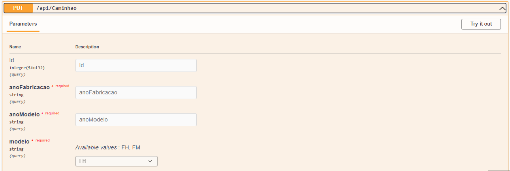

# :computer: CaminhaoAPI 

### .NET API CRUD de cadastro de caminhões `GET` `POST` `PUT` `DELETE`

### Visualizar os caminhões cadastrados

### Inserir um novo caminhão

### Atualizar as informações de um caminhão

### Excluir um caminhão

### Propriedades Aceitas

- [x] Modelo (aceita FH e FM)
- [x] Ano de Fabricação (Ano deverá ser o atual)
- [x] Ano Modelo (Poderá ser o atual ou o ano subsequente)

## 💻 Pré-requisitos

Antes de começar, verifique se você atendeu aos seguintes requisitos:

* Alterar a connectionString para os dados da sua maquina local 
       `"Server=SeuServidorLocal;Database=NomeDoBanco;User Id=UsuarioDoBanco;Password=SuaSenha;"`       

       
* BancoDeDados `SQL Server`
* Os Schemas `CaminhaoModel, EnumModel`

[⬆ Voltar ao topo](#CaminhaoAPI) 